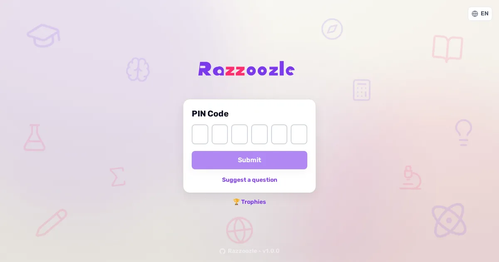

<div align="center">



# Razzoozle Desktop

### Die erste Windows-Desktop-App für Razzoozle — führe das Live-Quiz auf deinem eigenen PC aus; die Handys der Spielenden verbinden sich **direkt**.

🌐 [English](README.md) · **Deutsch** · [Español](README.es.md) · [Français](README.fr.md) · [Italiano](README.it.md) · [中文](README.zh.md)

[](#-status)


**[🎮 Razzoozle](https://github.com/joehomeskillet/Razzoozle)** · **[🛰️ Gateway](https://github.com/joehomeskillet/razzloo-gateway)** · **[Problem melden](https://github.com/joehomeskillet/razzoozle-desktop/issues)** · *führt [Razzoozle](https://github.com/joehomeskillet/Razzoozle) aus, geforkt von [Ralex91/Razzia](https://github.com/Ralex91/Razzia)*

</div>

---

## 🧩 Was ist das?

**Razzoozle Desktop** ist die **erste Windows-Desktop-App** für [Razzoozle](https://github.com/joehomeskillet/Razzoozle), die selbstgehostete Live-Quiz-Plattform. Sie führt das gesamte Spiel **auf deinem eigenen PC** aus — kein Server zum Mieten, kein Konto, keine Cloud. Du startest das Hosten, ein Code und ein QR erscheinen, und die Spielenden treten von ihren Handys aus bei. Im selben WLAN verbinden sich ihre Handys **direkt mit deinem Rechner**: kein Relay, keine Zwischenstelle, **es verlassen niemals Spieldaten den Host-PC**.

> 🎉 Dies ist die **erste Windows-App** für das Razzoozle-Projekt — ein Meilenstein, der das Live-Quiz von einem gehosteten Server auf den eigenen Desktop einer gastgebenden Person bringt.

Sie forkt oder kopiert Razzoozle **nicht**. Sie hostet **dieselben** `@razzoozle/web` und `@razzoozle/socket`, die auch das gehostete Produkt ausführt, verpackt in einer Electron-App.

---

## ⚙️ Wie es funktioniert

1. **Hosten starten.** Die App erkennt die LAN-Adresse deines PCs, bootet den wiederverwendeten Razzoozle-Web- und Socket-Server lokal und zeigt einen **Beitritts-Code + QR**.
2. **Spielende treten bei.** Sie scannen den QR oder tippen den Code auf ihren Handys ein.
3. **Direkte Verbindung.** Im **selben WLAN** ist es **LAN-direkt ohne jede Einrichtung** — das Handy navigiert direkt zur `http://`-Origin deines Hosts und verbindet sich unmittelbar. **Das gesamte Spielgeschehen läuft Handy ↔ Host; nichts geht durch einen Server dazwischen.**
4. **Erkennung über das LAN hinaus (opt-in).** Ein **opt-in Rendezvous-Gateway** (`gw.razzoozle.xyz`, das Repo [razzloo-gateway](https://github.com/joehomeskillet/razzloo-gateway)) hilft Handys, den Host zu **finden**, wenn sie nicht im selben Netzwerk sind. Es dient **nur der Erkennung** — es speichert Session-Metadaten und Kandidaten-Endpunkte, vergibt einen Beitritts-Code und übergibt den Handys die Adresse des Hosts. **Es leitet niemals Spielgeschehen weiter, hostet keinen Spielzustand, und es passieren keine Spieldaten.**

```
SO FUNKTIONIERT ES

(A) Gleiches WLAN — der einfache Fall, keine Einrichtung

    player phone  ──── join code / QR ───►  Razzoozle Desktop
                  ◄──────── game ─────────►  (host · your PC :7777)
                                             das Quiz verlässt niemals dein LAN

(B) Handy in einem anderen Netzwerk — opt-in Erkennung über das Gateway

    1) Razzoozle Desktop ──register CODE + addresses──►  Gateway (gw.razzoozle.xyz)
    2) phone   ──open  gw.razzoozle.xyz/j/CODE────────►  Gateway
    3) phone   ◄──────── host addresses ──────────────   Gateway
    4) phone   ═════════ connects DIRECT to host ═══════►  Razzoozle Desktop

    Das Gateway ordnet nur CODE -> Host-Adresse zu. Es speichert keine Spieldaten und
    leitet niemals Spielgeschehen weiter — sobald das Handy die Adresse hat, tritt es beiseite.
```

### Die Direktverbindung ist ehrlich über ihre Grenzen

Da es **kein Spiel-Relay** gibt, kann ein Handy, das **nicht** im WLAN des Hosts ist, den Host nur erreichen, wenn ein direkter Pfad existiert:

- ✅ **Selbes WLAN / LAN** — funktioniert ohne jede Einrichtung (der Standard, empfohlener Weg).
- ✅ **Öffentliches IPv6** — wenn Host und Handy beide funktionierendes IPv6 haben, ist eine direkte Verbindung möglich.
- ⚙️ **Port-Forwarding / UPnP** — ein weitergeleiteter Port (manuell oder per UPnP) macht den Host über IPv4 erreichbar.
- ✍️ **Manuell** — der Host teilt eine erreichbare Adresse direkt.

Gastnetzwerke und AP/Client-Isolation können Handy-zu-Host-Verbindungen selbst im selben WLAN blockieren — das ist eine Netzwerk-Richtlinie, die die App nicht umgehen kann. NAT ohne IPv6 oder ohne weitergeleiteten Port bedeutet, dass Handys außerhalb des LAN den Host nicht erreichen können. **Das Gateway hilft Handys nur dabei, den Host zu *finden*; es kann kein NAT durchbrechen und keinen Datenverkehr weiterleiten.**

---

## 🚦 Status

**Beta — in Arbeit.** Das LAN-Hosting im Kern funktioniert; einige Teile werden noch verdrahtet.

- ✅ Bootet den wiederverwendeten Razzoozle-Web- und Socket-Server, erkennt die LAN-IP, zeigt einen echten Beitritts-QR + URL.
- 🚧 Eine **signierte `.exe` über GitHub Releases kommt noch.** Vorerst bitte **aus dem Quellcode bauen und ausführen (dev)** — siehe unten.
- 🚧 Gateway-Session-Registrierung/Heartbeat und der Laufzeit-Update-Flow landen schrittweise.

Wenn der Installer kommt, wird die `.exe` selbst bei den ersten Releases **unsigniert** sein (eine einmalige Windows-**SmartScreen**-Warnung „unbekannte App" → *Weitere Informationen → Trotzdem ausführen*); die Update-**Integrität** stammt aus einem **minisign-signierten `latest.yml`**-Manifest, das vor jedem Update geprüft wird, nicht aus einer signierten Binärdatei.

---

## 📦 Installation & Ausführung (dev)

Dies ist der unterstützte Weg während der Beta. Du brauchst **Node.js**, **pnpm** (für den wiederverwendeten Kern) und **Electron** (über `npm` installiert).

**1 — Den wiederverwendeten Razzoozle-Kern bauen** (die Desktop-App hostet das vorgebaute Web + Socket):

```bash
cd /pfad/zu/Razzoozle
pnpm install
pnpm --filter @razzoozle/socket build   # -> packages/socket/dist
pnpm --filter @razzoozle/web build       # -> packages/web/dist
```

**2 — Die Desktop-App bauen und prüfen:**

```bash
cd /pfad/zu/razzoozle-desktop
npm install
npm run typecheck      # tsc --noEmit
npm run build          # tsc -> dist/
npm run smoke          # bootet den wiederverwendeten Server headless, prüft Ping/LAN/QR
```

**3 — Das Electron-Fenster ausführen** (auf einem Windows-Desktop):

```bash
npm run dev            # baut, startet dann electron .
```

Klicke auf **Start hosting**. Die App erkennt deine LAN-IPv4, bootet den wiederverwendeten Razzoozle-Server auf `0.0.0.0:7777` und zeigt einen QR + die LAN-URL `http://<lan-ip>:7777/`. Ein Handy im selben WLAN scannt ihn, öffnet die Host-Origin und verbindet sich direkt.

> Das volle Electron-Fenster braucht eine Anzeige, daher werden auf einem headless Server der Host-Server + die LAN-Erkennung + der QR durch `npm run smoke` (ohne Electron) geprüft. Auf einem Windows-Desktop öffnet `npm run dev` das echte Fenster.

---

## 🔗 Verwandte Projekte

- **[Razzoozle](https://github.com/joehomeskillet/Razzoozle)** — die selbstgehostete Live-Quiz-Plattform, die diese App ausführt.
- **[razzloo-gateway](https://github.com/joehomeskillet/razzloo-gateway)** — das opt-in Rendezvous-Gateway (`gw.razzoozle.xyz`): nur Erkennung, kein Spiel-Relay.

---

## 📝 Credits & Lizenz

Razzoozle Desktop hostet [**Razzoozle**](https://github.com/joehomeskillet/Razzoozle), das ein Fork von [**Ralex91/Razzia**](https://github.com/Ralex91/Razzia) ist — herzlichen Dank an die Upstream-Autoren. Die MIT-Linie von Razzoozle/Razzia bleibt erhalten.
